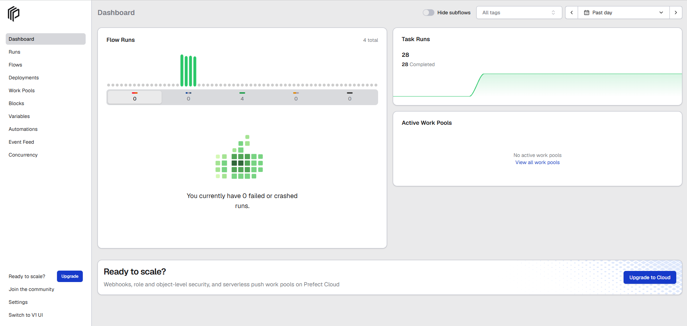
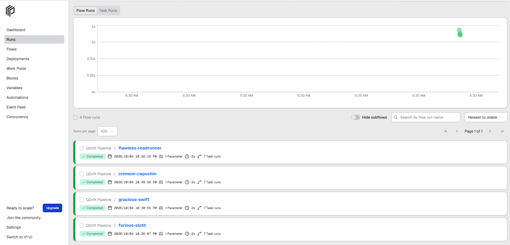
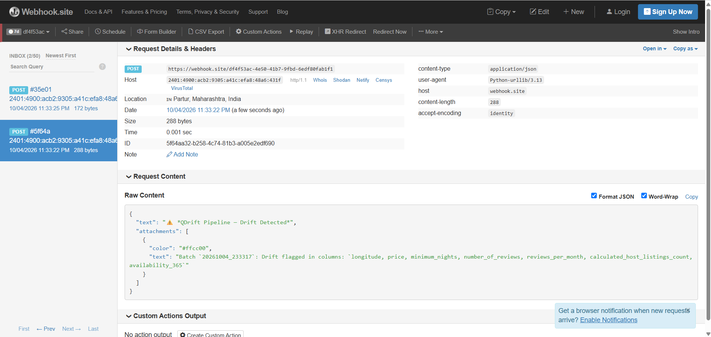

# QDrift — Automated Data Quality & Drift Detection Pipeline

A modular, config-driven, production-aware batch data engineering pipeline built in Python to understand and explore how real data flows through a system — from raw ingestion through quality validation, statistical drift detection, structured persistence, and automated alerting.

Built as a personal deep-dive into data engineering fundamentals: how pipelines are structured, how data quality degrades over time, how drift is detected statistically, and how production systems stay observable and fault-tolerant.

---

## What the Project Does

QDrift automates the ingestion and processing of raw datasets by executing a strict, sequential pipeline flow:

```
Ingest → Validate → Clean → Drift Detection → Save → Alert → Audit Report
```

1. **Ingestion** — Safely loads raw datasets (CSV, JSON, Parquet, Excel) with file existence checks, format auto-detection, and structured error propagation
2. **Validation** — Inspects raw data for structural issues: empty datasets, missing required columns, infinite values, and high null percentages — before any transformation occurs
3. **Cleaning** — Config-driven imputation (median for numerics, configurable fill value for categoricals), whitespace normalization, and duplicate removal
4. **Drift Detection** — Compares the processed dataset against a historical baseline using dual statistical methods: mean percentage shift and two-sample Z-score test, with smart auto-exclusion of high-cardinality identifier columns
5. **Database Persistence** — Appends clean data into SQLite via SQLAlchemy with per-run `batch_id` and `ingestion_timestamp` for full historical versioning
6. **Alerting** — Fires structured webhook alerts to Slack, Discord, or any HTTP endpoint on drift detection, pipeline success, or failure
7. **Observability** — Structured logging with severity levels across all modules, plus auto-generated JSON audit reports on every run — including failures

---

## Project Structure

```
data_quality_pipeline/
│
├── data/
│   ├── raw/                        # Raw input datasets (CSV, JSON, Parquet, Excel)
│   └── processed/                  # Historical baseline reference files
│
├── logs/                           # Structured pipeline log files
│
├── reports/                        # Auto-generated JSON execution audit reports
│
├── src/
│   ├── __init__.py
│   ├── ingest.py                   # Multi-format data loader with smart format detection
│   ├── validate.py                 # Config-driven data quality validation layer
│   ├── clean.py                    # Imputation, deduplication, normalization
│   ├── drift_detector.py           # Dual-method statistical drift analysis
│   ├── database.py                 # SQLAlchemy append-mode persistence layer
│   ├── alerts.py                   # Webhook alerting for Slack, Discord, custom endpoints
│   └── logger.py                   # Centralized structured logging setup
│
├── tests/
│   ├── test_clean.py               # 8 unit tests for cleaning logic
│   ├── test_ingest.py              # 9 unit tests for ingestion logic
│   ├── test_validate.py            # 10 unit tests for validation logic
│   └── test_drift_detector.py      # 10 unit tests for drift detection logic
│
├── config.json                     # Centralized pipeline configuration
├── main.py                         # Lightweight pipeline orchestrator (no server needed)
├── pipeline_flow.py                # Prefect orchestration flow with retries and dashboard
├── requirements.txt                # Python dependencies
└── README.md
```

---

## Tech Stack

| Layer | Tool |
|---|---|
| Language | Python 3.10+ |
| Data Processing | Pandas, NumPy |
| ORM / Database | SQLAlchemy, SQLite |
| Orchestration | Prefect 3 |
| Logging | Python `logging` module |
| Alerting | `urllib.request` — Slack / Discord / webhook |
| Reporting | Built-in `json`, `datetime`, `os` |
| Testing | pytest |

---

## Configuration

All pipeline parameters are externalized in `config.json` — no hardcoded values anywhere in the codebase:

```json
{
    "paths": {
        "raw_data_path": "data/raw/your_dataset.csv",
        "baseline_data_path": "data/processed/baseline.csv",
        "db_connection_string": "sqlite:///pipeline_storage.db",
        "table_name": "cleaned_dataset",
        "reports_dir": "reports",
        "logs_dir": "logs"
    },
    "cleaning_rules": {
        "drop_duplicates": true,
        "numeric_imputation_strategy": "median",
        "categorical_fill_value": "Unknown"
    },
    "drift_parameters": {
        "threshold": 0.15,
        "z_threshold": 1.96,
        "exclude_cols": []
    },
    "validation_rules": {
        "required_columns": [],
        "max_null_percentage": 0.30,
        "check_infinite_values": true,
        "fail_on_empty": true
    },
    "alerting": {
        "webhook_url": "",
        "enabled": false
    }
}
```

> `exclude_cols` and `required_columns` are intentionally left empty. The pipeline is general-purpose — identifier columns are auto-detected at runtime via smart cardinality inspection, and `required_columns` can be populated for dataset-specific schema enforcement.

> To enable alerting, set `enabled: true` and paste a Slack or Discord webhook URL into `webhook_url`.

---

## How to Run

### 1. Clone & Setup Environment

```bash
git clone https://github.com/lokhandesaurabh09/data_quality_pipeline.git
cd data_quality_pipeline
python -m venv venv
```

### 2. Activate Virtual Environment

**Windows (PowerShell):**
```bash
.\venv\Scripts\Activate.ps1
```

**Mac / Linux:**
```bash
source venv/bin/activate
```

### 3. Install Dependencies

```bash
pip install -r requirements.txt
```

### 4. Add Your Dataset

Drop your file into `data/raw/` (CSV, JSON, Parquet, or Excel) and create a baseline sample:

```python
import pandas as pd
df = pd.read_csv("data/raw/your_dataset.csv")
df.sample(frac=0.2, random_state=42).to_csv("data/processed/baseline.csv", index=False)
```

### 5. Update `config.json`

```json
"raw_data_path": "data/raw/your_dataset.csv"
```

That's the only change needed for a new dataset — everything else is auto-detected.

### 6. Run the Pipeline

**Option A — With Prefect Dashboard (Recommended)**

Terminal 1 — start the Prefect server:
```bash
prefect server start
```

Terminal 2 — run the pipeline:
```bash
python pipeline_flow.py
```

Open the live dashboard at `http://127.0.0.1:4200` to monitor every task run, retry, and log in real time.

**Option B — Lightweight (No Server)**

```bash
python main.py
```

Runs the full pipeline with structured logging and JSON report generation — no Prefect server required.

---

## Prefect Orchestration Dashboard

QDrift integrates with Prefect 3 for production-grade orchestration — every pipeline run is tracked as an independent flow with 7 named tasks, each with its own retry policy, logs, and execution time.

**Dashboard overview — 4 flow runs, 28 task completions, 0 failures:**

The dashboard shows each named run (`flawless-roadrunner`, `crimson-capuchin`, `gracious-swift`, `furious-sloth`) completing in ~2 seconds with 7 task runs each — fully tracked and searchable by run name, date, and status.





Each task is independently orchestrated with configurable retries:

| Task | Retries | Purpose |
|---|---|---|
| `Ingest Raw Data` | 3 | Load raw dataset with fallback attempts |
| `Validate Data` | 1 | Structural quality checks |
| `Clean Data` | 1 | Imputation and deduplication |
| `Detect Drift` | 1 | Statistical comparison against baseline |
| `Save to Database` | 2 | Append-mode persistence with versioning |
| `Generate Audit Report` | 0 | Always runs — even on failure |

---

## Sample Pipeline Output

```
INFO  | main_orchestrator | Starting Automated Data Pipeline Run
INFO  | ingest            | Loading raw data from 'data/raw/AB_NYC_2019.csv' (Format: CSV)...
INFO  | ingest            | Successfully loaded CSV dataset: 48895 rows, 16 columns.
INFO  | validate          | Dataset Shape Check Passed: 48895 rows, 16 columns.
INFO  | validate          | Data quality validation completed successfully!
INFO  | clean             | Duplicate Removal: Removed 0 duplicate rows.
INFO  | clean             | Imputed missing values in 'reviews_per_month' using median: 0.72
INFO  | drift_detector    | Smart Auto-Exclude: Column 'id' — high-cardinality (100.0%). Skipping.
INFO  | drift_detector    | Smart Auto-Exclude: Column 'host_id' — high-cardinality (86.29%). Skipping.
INFO  | drift_detector    | Column 'latitude' is stable.
WARNING | drift_detector  | Column 'number_of_reviews' drifted! Shift: 48.61%! | Z-Score: 30.7
INFO  | database          | Successfully appended 48895 rows. Batch ID: 20260927_120445.
INFO  | alerts            | Alert sent successfully: [WARNING] QDrift Pipeline — Drift Detected
INFO  | main_orchestrator | Pipeline execution finished successfully!
INFO  | main_orchestrator | Summary audit report saved to: reports/pipeline_report_20260927_120445.json
```

---

## Drift Detection — How It Works

QDrift uses **two independent statistical methods** per numeric column — a column is flagged if **either** method exceeds its threshold:

| Method | Formula | Catches |
|---|---|---|
| Percentage Change | `abs(current_mean - baseline_mean) / abs(baseline_mean)` | Large distributional shifts |
| Two-Sample Z-Score | `abs(c_mean - b_mean) / sqrt(b_std²/n_b + c_std²/n_c)` | Statistically significant shifts even when % change is small |

Using dual detection matters in practice — the Z-score catches shifts that percentage change alone silently misses. In the Airbnb dataset used for development, 4 columns (`longitude`, `price`, `minimum_nights`, `availability_365`) were flagged only by Z-score, not by percentage change.

**Smart Auto-Exclusion** automatically removes identifier columns from drift analysis without any manual configuration, using two rules:

- Uniqueness ratio > 95% — high-cardinality columns like UUIDs, transaction IDs
- Column name contains `_id`, `id_`, `_key`, `_uuid` — structural key naming pattern

This means drift detection works correctly on any new dataset immediately, with zero config changes.

Each column in the drift report carries a `drift_trigger` field explaining which method caught it:

```json
"number_of_reviews": {
    "baseline_mean": 45.29,
    "current_mean": 23.27,
    "pct_change_percent": 48.61,
    "z_score": 30.7,
    "drift_detected": true,
    "drift_trigger": "both"
}
```

---

## Alerting System

QDrift fires structured webhook alerts on three pipeline events — drift detection, successful completion, and failure. Alerts are compatible with Slack, Discord, and any HTTP endpoint accepting JSON.

**Sample drift alert payload received at webhook endpoint:**

```json
{
  "text": "⚠️ *QDrift Pipeline — Drift Detected*",
  "attachments": [
    {
      "color": "#ffcc00",
      "text": "Batch `20261004_233317`: Drift flagged in columns: `longitude, price, minimum_nights, number_of_reviews, reviews_per_month, calculated_host_listings_count, availability_365`"
    }
  ]
}
```


| Event | Status | Color |
|---|---|---|
| Pipeline Success | ✅ | Green `#36a64f` |
| Drift Detected | ⚠️ | Yellow `#ffcc00` |
| Pipeline Failure | 🚨 | Red `#ff0000` |

To enable: set `webhook_url` and `"enabled": true` in `config.json`. Alerting silently skips when disabled or when URL is empty — no code changes needed.

---

## Audit Report — Sample Structure

Every pipeline run generates a timestamped JSON report — always, even on failure:

```json
{
    "run_timestamp": "2026-09-27T12:04:45.123456",
    "status": "SUCCESS",
    "error": null,
    "metrics": {
        "raw_rows": 48895,
        "raw_columns": 16,
        "cleaned_rows": 48895,
        "duplicates_removed": 0,
        "validation_status": "PASSED",
        "drift_report": {
            "number_of_reviews": {
                "baseline_mean": 45.29,
                "current_mean": 23.27,
                "pct_change_percent": 48.61,
                "z_score": 30.7,
                "drift_detected": true,
                "drift_trigger": "both"
            },
            "summary": {
                "overall_drift_status": true,
                "threshold_used": 0.15,
                "z_threshold_used": 1.96,
                "excluded_columns": ["id", "name", "host_id"],
                "auto_excluded_columns": ["id", "name", "host_id"],
                "drift_method": "percentage_change + two_sample_z_test"
            }
        }
    }
}
```

---

## Supported Ingestion Formats

| Format | Extension | Reader |
|---|---|---|
| CSV | `.csv` | `pd.read_csv()` |
| JSON | `.json` | `pd.read_json()` |
| Parquet | `.parquet` | `pd.read_parquet()` |
| Excel | `.xls`, `.xlsx` | `pd.read_excel()` |

Format is detected automatically from the file extension — no configuration needed. Unsupported formats raise a clear `ValueError` with the list of supported extensions.

---

## Running the Test Suite

```bash
pytest tests/ -v
```

**Expected output:**

```
tests/test_clean.py          ........    8 passed
tests/test_drift_detector.py ..........  10 passed
tests/test_ingest.py         .........   9 passed
tests/test_validate.py       ..........  10 passed

37 passed in 0.49s
```

### Test Coverage

| Module | Tests | What's Covered |
|---|---|---|
| `clean.py` | 8 | Deduplication, median/mean imputation, text fill, empty df, no mutation |
| `ingest.py` | 9 | File not found, empty file, unsupported format, column order, null preservation, parametrized shapes |
| `validate.py` | 10 | Empty df, missing columns, null threshold, infinite values, parametrized shapes |
| `drift_detector.py` | 10 | No drift, significant drift, auto-exclusion, threshold sensitivity, summary integrity |

---

## Using With Your Own Dataset

This pipeline is built to be **dataset-agnostic**. To use it with any dataset:

1. Drop your file into `data/raw/` — CSV, JSON, Parquet, or Excel
2. Generate a baseline:
```python
df.sample(frac=0.2, random_state=42).to_csv("data/processed/baseline.csv", index=False)
```
3. Update `raw_data_path` in `config.json`
4. Run `python pipeline_flow.py` or `python main.py`

The pipeline automatically:
- Detects the file format from extension
- Identifies and excludes identifier columns from drift analysis
- Imputes nulls using the configured strategy
- Versions every run with a unique `batch_id`
- Fires alerts if drift is detected
- Generates a full audit report regardless of outcome

---

## V1 → V2 → V3 Evolution

| Feature | V1 | V2 | V3 |
|---|---|---|---|
| Database mode | `replace` — wipes data | Append + `batch_id` versioning | ✅ |
| Logging | `print()` | Structured `logging` | ✅ |
| Drift detection | Mean % change only | + Two-sample Z-score | ✅ |
| Identifier handling | False alarms on IDs | Smart auto-exclusion | ✅ |
| Configuration | Hardcoded | Fully config-driven | ✅ |
| Error handling | Silent crash | `try/except/finally` | ✅ |
| Validation | None | Dedicated `validate.py` | ✅ |
| Pipeline order | Ingest → Clean → Drift | Ingest → Validate → Clean → Drift | ✅ |
| Test suite | None | 36 tests | 37 tests |
| Orchestration | None | None | Prefect 3 with retries |
| Multi-format ingestion | CSV only | CSV only | CSV, JSON, Parquet, Excel |
| Alerting | None | None | Slack / Discord / webhook |

---

## Known Limitations

- **Local SQLite only** — suitable for development and learning; production deployments would use PostgreSQL, BigQuery, or a cloud data warehouse
- **Batch processing only** — designed for scheduled batch runs; not suited for real-time or streaming pipelines
- **Numeric drift only** — drift detection currently covers numeric columns; categorical distribution drift is not yet implemented
- **No PSI** — Population Stability Index (the industry standard in financial ML) is not yet implemented alongside Z-score and percentage change

---

## Roadmap

- [ ] PSI (Population Stability Index) as third drift method
- [ ] Categorical column drift detection
- [ ] CLI interface via `argparse` — run with `qdrift --dataset my_data.csv`
- [ ] Config auto-generator — point at a dataset, auto-build `config.json`
- [ ] Docker containerization — run anywhere without environment setup
- [ ] PostgreSQL support alongside SQLite
